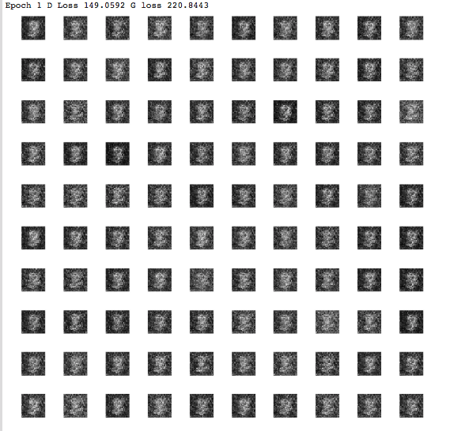
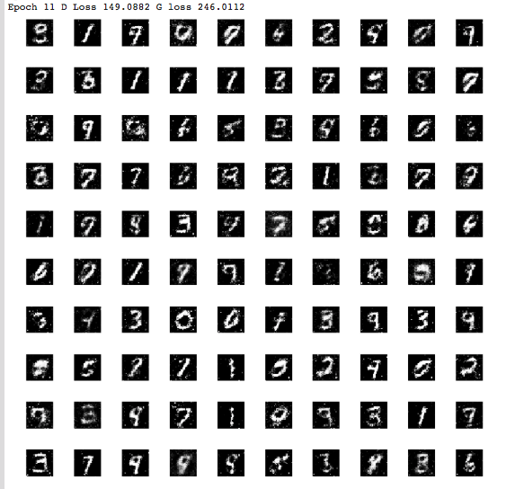
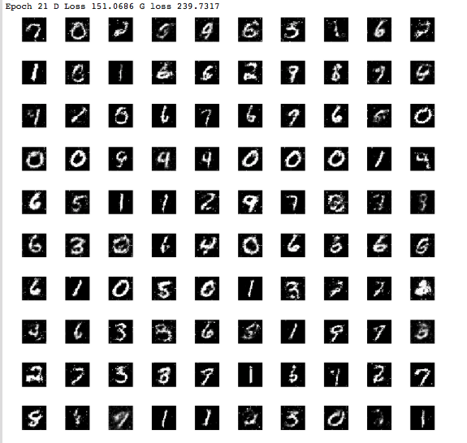
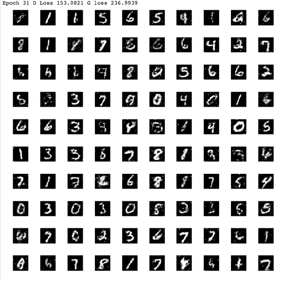
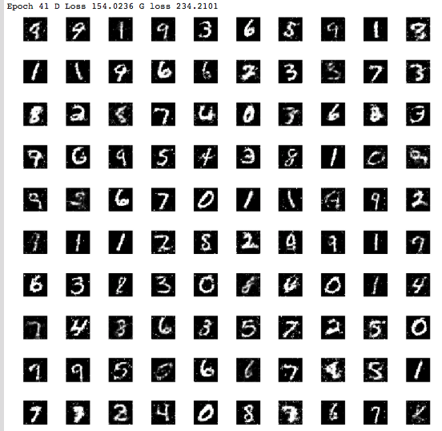
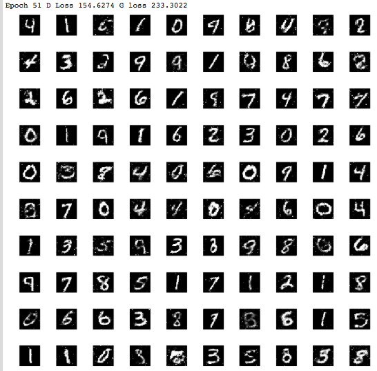

# Generative_Adversarial_Networks
Project to generate mnist digits using generative adversarial networks

### Epoch - 1 

### Epoch - 11

### Epoch - 21 

### Epoch - 31 

### Epoch - 41 

### Epoch - 51 

